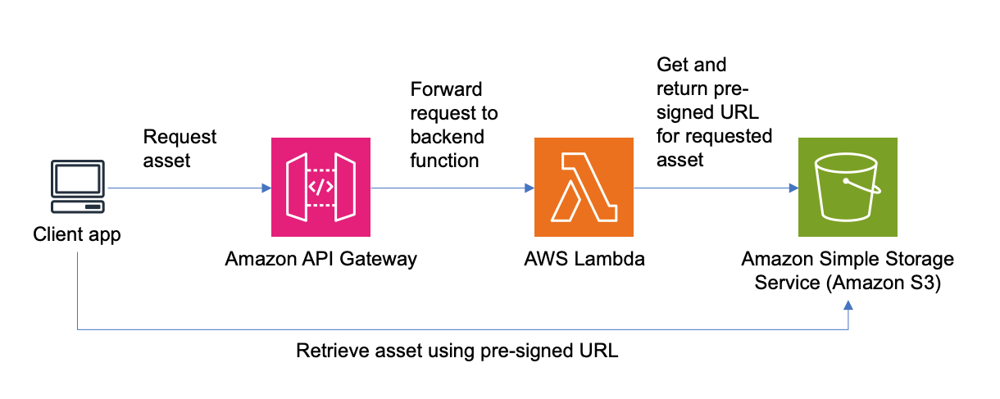

# Workshop Part Three



In the previous parts of the workshop, you might have noticed that assets are managed locally. This workshop will teach you how to host and retrieve assets from S3 using S3 pre-signed URLs, and answer why we are using S3? 

__Scalability and durability__: Amazon S3 a foundational object storage service, built to store and retrieve any amount of data from anywhere with 11 9s of data durability. Whether it's a handful of users or a whole carnival, S3 delivers.

__Secured access__: S3 pre-signed URLs offer time-bound, secured access to objects in S3. 

__Quick retrieval__: WebXR apps and assets can be chunky, and we want to provide optimal load times with less waiting.

__Decoupled storage__: Keeping data up to date can be managed separately from the application when using S3. Pushing updates to assets can be a separate pipeline from app deployments.

## Prerequisites

This workshop does not use artifacts from the previous workshop. Follow these steps to set up your environment - 

Stash your local changes from workshop_one, so you can switch to the workshop two branch. 
```
git stash
```

Check out the `workshop_two` branch 
```
git checkout workshop_two
```

Navigate to the `infra/` folder from the project root, and delete the cloud assembly output folder 
```
rm -rf cdk.out
```

## Step one: Create and hook up Lambda backend

### 1.1 Create getAssetLambda 

Go to the `infra/lib` folder, open `main.ts`, and uncomment this line of code: 

```javascript
const getAssetLambda = new LambdaStack(scope, "getAssetLambda", cdk.aws_lambda.Runtime.NODEJS_18_X, '../lambdaScripts/getAsset', 'handler', cdk.Duration.minutes(5), 512, 512, storageEnvs);
```

### 1.2 Create API Gateway method integration to trigger the getAssetLambda function 

Still in `infra/lib/main.ts`, uncomment this line of code:

```javascript
apiGateway.AddMethodIntegration(getAssetLambda.MethodIntegration(), "assets", "GET", apiAuthorizer);
```

### 1.3 Create the getAsset Lambda function JavaScript code 

Go to the `infra/lambdaScripts` folder, open `getAsset/getAsset.js`, and uncomment this code block: 

```javascript 
export const handler = async (event) => {
    console.log('Received event:', JSON.stringify(event, null, 2));

    try {
        const key = event.queryStringParameters.assetKey;
        const expires = event.queryStringParameters.expires;

        if (!key) {
            return jsonResponse(400, { message: "Key parameter is required" });
        }

        const psUrl = await getPresignedUrl(key, expires);
        console.log('ps_url:', psUrl);

        const response = jsonResponse(200, { "ps_url": psUrl });
        console.log('Response:', JSON.stringify(response, null, 2));


        return response;
    } catch (error) {
        console.error(error);
        return jsonResponse(500, { "message": error.toString() });
    }
};
```
This function code generates a pre-signed URL for the requested asset key in S3. This pre-signed URL is returned to the application. 

If you're new to presigned URLs, think of it as a way to grant access to an object in S3 without needing to configure either an identity policy (e.g. authorizing an IAM role to get objects from S3) or resource policy (e.g. setting a policy on the bucket to allow a principal to get objects from S3). A presigned URL grants time-bound permission to download objects. 

### 1.4 Deploy CDK changes

Go to the `infra` folder, and run 
```
cdk deploy
```

This will deploy the application backend including the Lambda function and API Gateway integration added in the previous steps. 

### 1.5 Update Amplify configuration

Go to the `web/src` folder, open `amplifyconfigure.js`, and replace the parameters with values from your CDK output. Also, update the region if you are using us-west-2.

```javascript
Auth: {
    // REQUIRED - Amazon Cognito Identity Pool ID
    identityPoolId: '<REPLACE_W_YOUR_IDENTITYPOOLID>',
    
    // REQUIRED - Amazon Cognito Region
    region: 'US-EAST-1',
    
    // REQUIRED- Amazon Cognito User Pool ID
    userPoolId: '<REPLACE_W_YOUR_USERPOOLID>',

    userPoolWebClientId: '<REPLACE_W_YOUR_USERPOOLWEBCLIENTID>',

    // OPTIONAL - Enforce user authentication prior to accessing AWS resources or not
    mandatorySignIn: true,
  },
  Api: {
    url: '<REPLACE_W_YOUR_APIRESTURL>'
  }
```

This configuration enables Amplify to interact with the AWS resources that were deployed using the CDK.

## Step two: Update application code

### 2.1 Add a function to load assets

Go to the `web/src` folder, open `fetchurl.js`, and uncomment these lines of code:

```javascript
export async function loadAsset(assetType, assetKey, processAsset, retryCount = 0) {
    try {
        const preSignedUrl = await fetchPreSignedUrl(assetKey);

        const loader = LOADERS[assetType];
        if (!loader) {
            throw new Error(`No loader defined for asset type: ${assetType}`);
        }

        console.log("presignedURL" + preSignedUrl);

        return loader.load(preSignedUrl, processAsset, undefined, (err) => {
            console.error(`Failed to load the asset: ${assetKey}`, err);
            if (retryCount < MAX_RETRIES) {
                console.log(`Retrying to load asset: ${assetKey}. Attempt ${retryCount + 1}`);
                loadAsset(assetType, assetKey, processAsset, retryCount + 1);
            } else {
                console.error(`Failed to load asset: ${assetKey} after ${MAX_RETRIES} attempts.`);
            }
        });
    } catch (err) {
        console.error(`Failed to load the asset: ${assetKey}`, err.message);
        if (retryCount < MAX_RETRIES) {
            console.log(`Retrying to load asset: ${assetKey}. Attempt ${retryCount + 1}`);
            loadAsset(assetType, assetKey, processAsset, retryCount + 1);
        } else {
            console.error(`Failed to load asset: ${assetKey} after ${MAX_RETRIES} attempts.`);
        }
    }
}
```

This function will replace the orginal local loaders in the application code.

### 2.2 Update flap.js loaders

First, update loader imports.

Go to `web/src`, open `flap.js`. 

Comment out the original loader import:

```javascript
import { GLTFLoader } from 'three/examples/jsm/loaders/GLTFLoader';
```

And uncomment this line to import the new loader:

```javascript
import { loadAsset } from './fetchurl';
```

Next, in the same file, update which loader is used during initialization. 

Comment out this code block that uses GLTFLoader to load local assets:

```javascript
new GLTFLoader().load('assets/wing.glb', (gltf) => {
    const rightWing = gltf.scene;
    const leftWing = rightWing.clone(true);
    leftWing.scale.set(-1, 1, 1);
    playerSpace.add(rightWing, leftWing);
    this._wings.left = leftWing;
    this._wings.right = rightWing;
});
```
And uncomment this code block that uses the custom load asset function:

```javascript
loadAsset('gltf', 'assets/wing.glb', (gltf) => {
    const rightWing = gltf.scene;
    const leftWing = rightWing.clone(true);
    leftWing.scale.set(-1, 1, 1);
    playerSpace.add(rightWing, leftWing);
    this._wings.left = leftWing;
    this._wings.right = rightWing;
});

```

### 2.3 Update game.js and scene.js loaders

Similar edits are required for game.js and scene.js. See if you can replace the old loader(s) with the new custom loader. Each file is a little different in that there are different loaders being used, but generally speaking, you'll be swapping imports and updating code that calls the loader.

Click on the arrows below to reveal detailed steps below to check your work.

<details><summary>game.js updates</summary>
<p>

Comment out the original texture loader `TextureLoader` imported from ThreeJS 

Uncomment import of the new loader:

```javascript
import { loadAsset } from './fetchurl';
```

Comment out code that uses the TextureLoader():

```javascript
const SCORE_BOARD_TEXTURE = new TextureLoader().load('assets/scoreboard.png');
SCORE_BOARD_TEXTURE.colorSpace = SRGBColorSpace;
```

Uncomment this code block in prepare() to use the new loader:

```javascript
this.SCORE_BOARD_TEXTURE = await loadAsset('exr', 'assets/scoreboard.png');
if (!this.SCORE_BOARD_TEXTURE){
    console.error("Assets was not loaded correctly");
	return;
}
console.log("score board" + this.SCORE_BOARD_TEXTURE);
this.SCORE_BOARD_TEXTURE.colorSpace = SRGBColorSpace;
```
</p>
</details>

<details><summary>scene.js updates</summary>
<p>

Comment out the original loader import:

```javascript
import { EXRLoader } from 'three/examples/jsm/loaders/EXRLoader.js';
import { GLTFLoader } from 'three/examples/jsm/loaders/GLTFLoader';
```

Uncomment import of the new loader:

```javascript
import { loadAsset } from './fetchurl';
```

Comment out these code blocks that use the EXRLoader() and GLTFLoader():

```javascript
new EXRLoader().load('assets/venice_sunset_1k.exr', (texture) => {
	const envMap = pmremGenerator.fromEquirectangular(texture).texture;
	pmremGenerator.dispose();
	scene.environment = envMap;
});

new GLTFLoader().load('assets/flappybird.glb', (gltf) => {
	scene.add(gltf.scene);
});
```

Uncomment these code blocks to use the new loader:

```javascript
loadAsset('exr', 'assets/venice_sunset_1k.exr', (texture) => {
    const envMap = pmremGenerator.fromEquirectangular(texture).texture;
    pmremGenerator.dispose();
    scene.environment = envMap;
})

loadAsset('gltf','assets/flappybird.glb', (gltf) => {
    scene.add(gltf.scene);
})
```
</p>
</details>

### 2.4 Test the application locally

Navigate to the `web/` folder and run: 

```
npm run serve 
```

Open [localhost:8081](https://localhost:8081) in a browser. Notice you're presented with a login prompt.

Enter a username, password, and your email address, and click "Sign Up"


Email verification is disabled, so go ahead and click "Sign In" with your new user account to access the game.


# Thank you

That concludes the workshop, hopefully you learned a thing or two to enhance your game!


