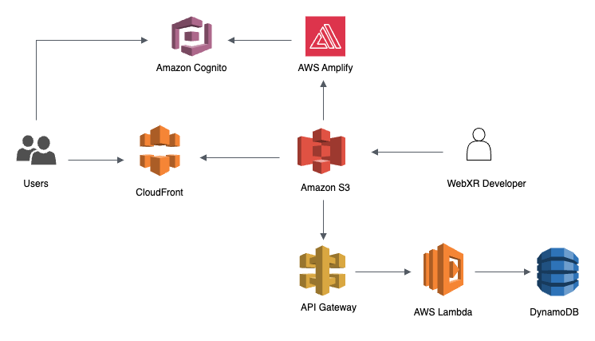

# Welcome to the AWS WebXR workshop

In this workshop, you will discover how to leverage a suite of AWS services to create a robust backend for your WebXR application. You'll learn how to host your app and make it publicly accessible via a URL, as well as how to efficiently render your assets from the cloud.

> This workshop is centered around the Meta WebXR showcase example, [Flap Frenzy](https://github.com/felixtrz/flap-frenzy). However, it specifically focuses on AWS usage within this context. For more information on the WebXR aspects of the app, please refer to the repository's example.



# AWS CDK

In this workshop, we're utilizing the power of AWS Cloud Development Kit (AWS CDK) to streamline the setup of our backend services. AWS CDK provides a high-level, programmatic approach to defining cloud resources, allowing us to create complex infrastructure setups with just a few lines of code. With AWS CDK, we'll be able to rapidly provision and manage the services that form the backbone of our WebXR application, including hosting and asset rendering, all directly within the workshop environment. Experience firsthand the efficiency and flexibility that AWS CDK brings to cloud development.

# Prerequisite:

## CDK Setup

Install the AWS CLI (skip if already installed on your system).

```
pip install awscli
```

or

```
brew install awscli
```

Configure the AWS CLI with your credentials, and set the default region to us-east-1 or us-west-2 (skip if already configured). See how to create and find your credentials from this [link](https://catalog.us-east-1.prod.workshops.aws/workshops/0ec8648d-8d3e-43d2-84ee-26c85152993b/en-US/configuration).

```
aws configure
```

Install the AWS CDK CLI.

```
npm install -g aws-cdk
```

Check CDK installation, and bootstrap your AWS account. Bootstrapping sets up resources (e.g. S3 bucket) for CDK to function in the target account and region (e.g. us-west-2).

```
cdk --version
cdk bootstrap aws://<REPLACE_WITH_YOUR_AWS_ACCT_NUMBER>/<REPLACE_WITH_AWS_REGION_CODE>
```

# Jump to workshop one:

You're all set to start with workshop one, click here -> [workshop_one](https://gitlab.aws.dev/hukaiyin/webxrhackathon_2023_workshop/-/tree/workshop_one?ref_type=heads) or select "workshop_one" from this repository's branches to access the README.
