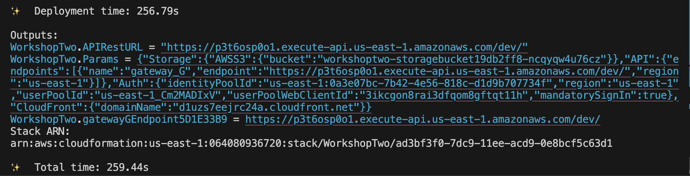
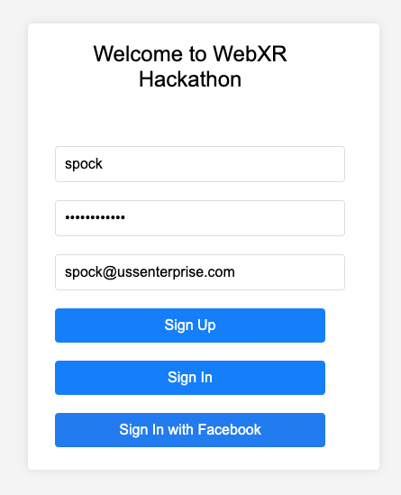

# Workshop Part Two

This workshop focuses on securing the API backend. You will implement user sign-in and authentication as well as add an authorizer to the API. Implementing authentication and authorization is not merely a best practice, but a critical component of a robust security strategy. Without it, your API is exposed, making it vulnerable to threats like DDoS attacks.

### What you'll learn:

- How to use the AWS Amplify SDK to simplify user registration and sign-in.
- How to configure AWS Cognito using the Amplify SDK to generate authentication tokens.
- How AWS Amplify streamlines the authentication process with dedicated libraries.

### Components:

__AWS Amplify SDK__: a set of libraries that simplify the developer experience when interacting with AWS services. The Auth library, for example, makes it easy for developers to add authentication flows to their apps. <br> 
__AWS Cognito__: Utilized within the Amplify SDK to handle user authentication and token generation. <br>

__Files and UI Elements__:
The main logic behind our authentication experience is encapsulated within the auth.js file. Additionally, be prepared to engage with some essential UI components, which will be presented in HTML and CSS formats.

## Prerequisites

This workshop does not use artifacts from the previous workshop. Follow these steps to set up your environment - 

Stash your local changes from workshop_one, so you can switch to the workshop two branch. 
```
git stash
```

Check out the `workshop_two` branch 
```
git checkout workshop_two
```

Navigate to the `infra/` folder from the project root, and delete the cloud assembly output folder 
```
rm -rf cdk.out
```

## Step 1: Enable Cognito backend

We will walk through the CDK code changes to implement Cognito.

### 1.1 Add an authorizer to the API

Go to the `infra/lib` folder, and uncomment these three lines in `main.ts`:

```javascript
const apiAuthorizer = apiGateway.AddCognitoAuthorizer(scope, "API_Authorizer", [cognitoStack.userPool])

apiGateway.AddMethodIntegration(putHighScoreLambda.MethodIntegration(), "leaderboard", "POST", apiAuthorizer);

apiGateway.AddMethodIntegration(getHighScoreLambda.MethodIntegration(), "leaderboard/{playerId}", "GET", apiAuthorizer);
```

Recall in the workshop_one branch, there was also an API Gateway integration defined which enabled you to interact with it. The main difference here is the addition of the Cognito Authorizer to the method integration definition for request authorization. 

### 1.2 Enable player sign-up backend

Go to the `infra/components` folder, and uncomment this code in `cognito.ts` 

```javascript
lambdaTriggers: {
    preSignUp: preSignupFunction
},
```

This enables the Cognito user pool to trigger a Lambda function after user sign up. You can have your own custom logic here for example like MFA, but in this workshop, we just auto approve the signup. 

## Step 2: Deploy changes and update configs

### 2.1 Deploy CDK

Go to the `infra/` folder from the project root, and deploy the CDK changes.
```
cdk deploy
```

A successful deployment will have an output similar to this. Note your CDK outputs for later: 



### 2.2 Update Amplify configuration

Go to the `web/src` folder, open `amplifyconfigure.js`, and replace the parameters with values from your CDK output. Also, update the region if you are using us-west-2.

```javascript
Auth: {
    // REQUIRED - Amazon Cognito Identity Pool ID
    identityPoolId: '<REPLACE_W_YOUR_IDENTITYPOOLID>',
    
    // REQUIRED - Amazon Cognito Region
    region: 'US-EAST-1',
    
    // REQUIRED- Amazon Cognito User Pool ID
    userPoolId: '<REPLACE_W_YOUR_USERPOOLID>',

    userPoolWebClientId: '<REPLACE_W_YOUR_USERPOOLWEBCLIENTID>',

    // OPTIONAL - Enforce user authentication prior to accessing AWS resources or not
    mandatorySignIn: true,
  },
  Api: {
    url: '<REPLACE_W_YOUR_APIRESTURL>'
  }
```

This configuration enables Amplify to interact with the AWS resources that were deployed using the CDK.

## Step 3: Update application code

### 3.1 Add sign-up logic using Amplify SDK

Go to the `web/src` folder, open `auth.js`, uncomment this code block:

```javascript
try {
    const { user } = await Auth.signUp({
        username,
        password,
        attributes: {
            email // If using email
        }
    });
    console.log('Sign up success!', user);
    // Handle successful sign-up logic here
    // Displaying success message 
    showMessage('Sign up successful! Please use the same username and password to sign in', 'success');
} catch (error) {
    console.error('Error signing up:', error);
    // Handle errors or show messages to user
    showMessage('Error signing up: ' + error.message, 'error');
}
```

The Amplify Auth class greatly simplifies handling auth flows from user sign-up, which we're enabling above, to handling sign-in and sign-out. 

### 3.2 Add sign-in logic using Amplify SDK

In the same `auth.js` file, uncomment this code: 

```javascript
try {
    const user = await Auth.signIn(username, password);
    console.log('Sign in success!', user);
    // Ensuring the session is established before fetching it and redirecting.
    await new Promise(resolve => setTimeout(resolve, 1000));  // wait for a second
    const session = await Auth.currentSession();
    console.log("session is", session);

    window.location.href = "main.html";
} catch (error) {
    console.error('Error signing in:', error);
}
```

These changes enable you to create both sign-up/sign-in pages and have it connect to the Coginito user pool. 

### 3.3 Get auth token from Auth.currentSession()

After sign-in, you can retrieve the user's current session information using the Auth class. You can access the access token as needed.

Go to the `web/src` folder, open `game.js`, and uncomment these lines: 

```javascript 
const session = await Auth.currentSession();
this.ID_TOKEN = session.getIdToken().getJwtToken();
```

### 3.4 Use the token to call the API 

The previous step retrieves the access token needed for token authentication when calling the API Gateway. In the same `game.js` file, uncomment the line that adds an authorization header with the token in the `getPlayerInfo()` function: 

```javascript
getPlayerInfo() {
		return fetch(`${API_GATEWAY_URL}/leaderboard/${this._playerId}`, {
			method: 'GET',
			headers: {
				'Content-Type': 'application/json',
				Authorization: `Bearer ${this.ID_TOKEN}`
			}
		})
}
...
```

### 3.5 Test the application locally

Navigate to the `web/` folder and run: 

```
npm run serve 
```

Open [localhost:8081](https://localhost:8081) in a browser. Notice you're presented with a login prompt.

Enter a username, password, and your email address, and click "Sign Up"



Email verification is disabled, so go ahead and click "Sign In" with your new user account to access the game.

Your API requests are now authenticated. If you comment out the authorization header and try to reload the page, you will see an error such as "No Auth" in the developer tools.

# Jump to workshop three:

You're all set to progress to workshop three, click here -> [workshop three](https://gitlab.aws.dev/hukaiyin/webxrhackathon_2023_workshop/-/tree/workshop_three?ref_type=heads) or select "workshop_three" from this repository's branches to access the README.